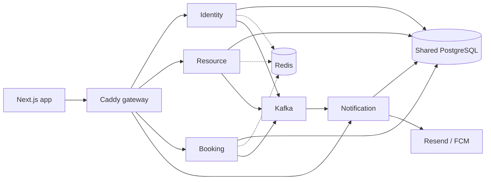
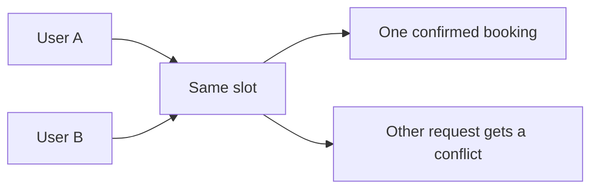
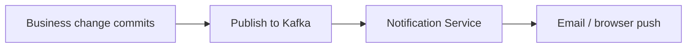
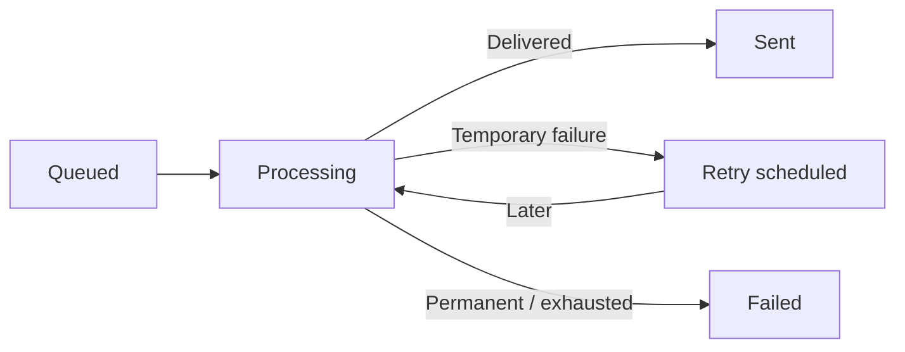
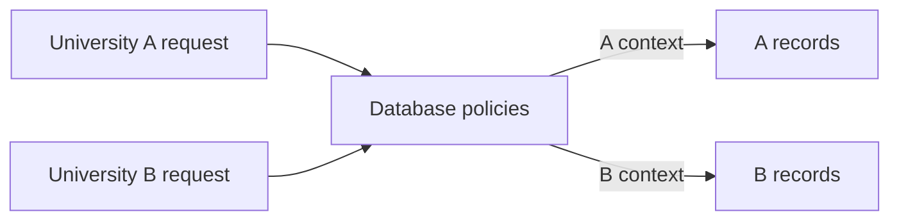
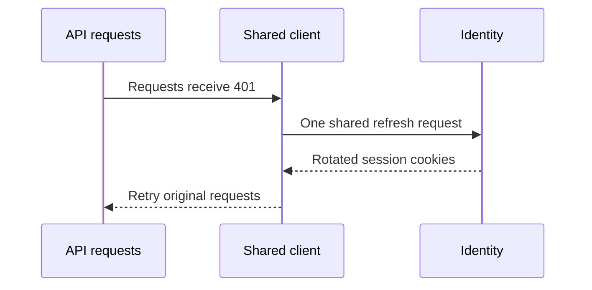
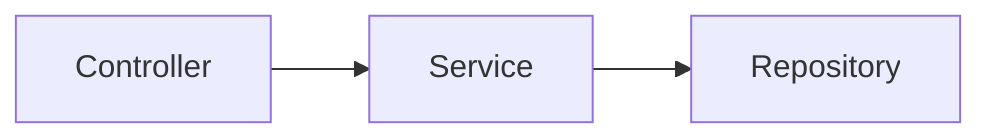
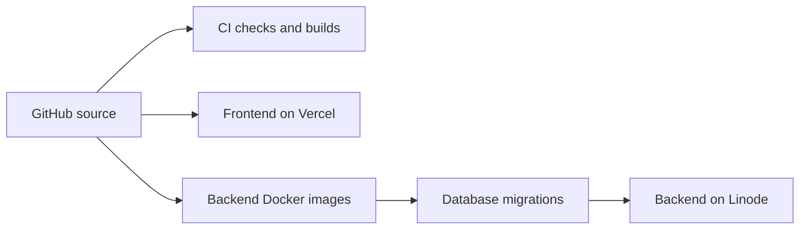

<div class="brand">
  
  <h1>ResourceHive</h1>
</div>

<p class="tagline">One place to discover, share, and book campus resources.</p>

<p class="subtitle">Design, reliability, and user experience.</p>

<!--
Time: 0:25.
ResourceHive helps university departments and clubs share rooms, equipment, and other resources. Members discover resources and reserve published slots; administrators manage access and availability. This talk explains the product, six architectural decisions, and the evidence behind them. The live application demo is separate from the 12–15 minute slide presentation.
Source: resourcehive/README.md, architecture and product description.
Evaluation question: What is the main value? A shared view of availability with reliable booking rules and clear responsibility.
-->

---
title: The problem we solve
---

# The problem we solve

<p class="lead">Unclear availability. Booking clashes. Scattered coordination.</p>

<div class="split">
  <div>
    <h2 class="icon-heading"><carbon-user /> Members</h2>
    <p>Find resources, reserve slots, and track bookings.</p>
  </div>
  <div>
    <h2 class="icon-heading"><carbon-user-admin /> Administrators</h2>
    <p>Publish availability, approve access, and manage usage.</p>
  </div>
</div>

<div class="divider"></div>

<p>One shared record makes the rules and responsibilities clear.</p>

<!--
Time: 0:40.
Before a shared system, people coordinate availability through messages or spreadsheets. ResourceHive brings discovery, published slots, bookings, points, and administration into one application. A member can act only through approved memberships. An administrator manages the resources and bookings they are authorized to administer. Controls in the GUI help the user, while backend checks enforce the rule.
Sources: README.md; services/booking-service/src/authorization/booking-authorization.service.ts; services/resource-service/src/memberships/; apps/web/src/components/resource-catalogue.tsx.
Demo cue: Explain the difference between the member and administrator views before switching accounts.
Evaluation question: Does hiding a button enforce access? No. The backend must authorize the action as well.
-->

---
title: What we will demonstrate
---

# What we will demonstrate

<ol class="demo-steps">
  <li><carbon-search /><strong>Find a resource</strong><span class="screen">Catalogue → discover permitted resources</span></li>
  <li><carbon-calendar /><strong>Book a slot</strong><span class="screen">Booking dialog → choose available time</span></li>
  <li><carbon-receipt /><strong>Check the result</strong><span class="screen">Confirmation + points → verify the reservation</span></li>
  <li><carbon-settings /><strong>Manage usage</strong><span class="screen">Bookings → eligible cancellation or admin completion</span></li>
</ol>

<p class="app-link"><a href="https://app.resourcehive.thisismalindu.com" target="_blank" rel="noopener noreferrer">Open the ResourceHive application ↗</a></p>

<!--
Time: 0:40. Live demonstration time is separate.
Demonstrate the deployed application in a browser, without starting source code in an IDE. Prepare approved member and administrator accounts, an active resource, a future slot, and enough member points before the evaluation. Do not display passwords or private user records in the slides.
Suggested live demo: browse and filter the catalogue; open resource details; reserve a future slot; show the confirmation and balance; then show eligible cancellation or an administrator completing a suitable booking. Explain the requirement met by each GUI. State changes for cancellation and completion differ; avoid presenting them as interchangeable.
This deck does not claim the web application is a Windows executable. Confirm any exact executable-file submission requirement with the evaluators separately.
Sources: apps/web/src/components/resource-catalogue.tsx; resource-booking-dialog.tsx; booking-confirmation.tsx; my-bookings.tsx; organization-bookings.tsx.
Evaluation question: What if the chosen slot is taken during the demo? Show the conflict message and reload availability.
-->

---
title: How the system fits together
class: architecture
---

# How the system fits together



<p class="quiet">Four NestJS services. One public backend entry point. A shared database.</p>

<!--
Time: 1:00.
The frontend is Next.js on Vercel. Caddy routes the public API to four NestJS services on a private Docker network on Linode. PostgreSQL is hosted on Neon; Redis is used by selected reads; Kafka is hosted on Aiven. Resend delivers identity-related email, and Firebase Cloud Messaging delivers browser push. Notification history is also available through the API.
Identity handles accounts and sessions; Resource handles organizations, memberships, and resources; Booking handles slots, bookings, points, and related operations; Notification handles notification processing and delivery. The gateway also routes Socket.IO traffic to Notification Service.
The dashed Redis connections indicate configured caching, not that every request or endpoint is cached. Identity has Redis configured; do not claim every identity read uses it. These are separate deployed services sharing a PostgreSQL database, not a database-per-service architecture. The architecture needs more nodes than the feature diagrams to show the actual boundaries accurately.
Sources: README.md; services/api-gateway/Caddyfile; docker-compose.prod.yml; services/*/src/app.module.ts; services/notification-service/docs/architecture.md.
Evaluation question: Why split services? Clear responsibilities and separate deployment artifacts, with the cost of extra communication and shared-database coupling.
-->

---
title: Preventing double bookings
---

# Preventing double bookings

<p class="problem">Two users can select the same available slot.</p>

<div class="split wide-diagram">
  <div class="feature-copy">
    <span class="label">How it works</span>
    <p>Serializable transactions.<br>Up to three attempts.<br>Database constraints.</p>
  </div>
  <div class="feature-diagram">



  </div>
</div>

<p class="benefit"><strong>Benefit:</strong> the booking and points deduction succeed together.</p>

<!--
Time: 1:00.
An initial availability check is useful, but two requests can pass it together. BookingService uses a serializable transaction and retries serialization conflicts up to three total attempts. A PostgreSQL partial unique index allows only one confirmed or completed booking per slot. A GiST exclusion constraint also prevents overlapping slots for one resource.
Within the same transaction, the service validates access and points, creates the booking, and appends the deduction. A failure rolls back the operation. Conflict errors are translated into meaningful API responses, and the booking GUI clears a stale selection and reloads slots after a 404 or 409. This is concurrency control, not unlimited retries or a blanket exactly-once guarantee.
Sources: services/booking-service/src/bookings/booking.service.ts, createBooking and createWithinTransaction; db/schema/migrations/20260724000000_initial/migration.sql, resource_slots_no_overlap and bookings_active_slot_unique; apps/web/src/components/resource-booking-dialog.tsx.
Evaluation question: Why not just check whether the slot is free? Checking and writing can race unless the database enforces the rule.
-->

---
title: Keeping points accurate and traceable
---

# Keeping points accurate and traceable

<p class="problem">Users need a correct balance and an explainable history.</p>

<div class="point-example">
  <div><span class="amount">100</span><span class="action">Starting balance</span></div>
  <carbon-arrow-right />
  <div><span class="amount">75</span><span class="action">Book · −25</span></div>
  <carbon-arrow-right />
  <div><span class="amount">100</span><span class="action">Eligible refund · +25</span></div>
</div>

<p class="diagram-caption">Illustrative example</p>

<div class="point-rules">
  <div><strong>Append-only history</strong><br>Preserve each movement.</div>
  <div><strong>Maintained balance</strong><br>Read the current total.</div>
  <div><strong>Unique entries</strong><br>Prevent duplicate charges.</div>
</div>

<p class="benefit"><strong>Benefit:</strong> traceable changes with an efficient balance lookup.</p>

<!--
Time: 0:55.
The ledger records additions, booking deductions, and refunds as separate entries. Database triggers reject updates or deletions of ledger entries. A trigger maintains the university-specific current balance, so reading it does not require summing the entire history each time. Unique indexes protect against duplicate booking deductions and refunds. A deduction must update an existing balance and cannot overdraw it.
The numbers on this slide are an illustrative example, not a measured result or a guaranteed join bonus. Refund eligibility depends on the cancellation rules and the booking's state; do not imply that every cancellation always receives a refund. Booking creation and deduction share a transaction; cancellation and its applicable refund are handled together as well.
Sources: services/booking-service/src/points/point-ledger.service.ts and point-ledger.repository.ts; db/schema/migrations/20260724000000_initial/migration.sql, append-only and unique ledger constraints; db/schema/migrations/20261001120000_fix_university_point_deductions/migration.sql.
Evaluation question: Why keep a ledger and a balance? The ledger explains history; the maintained balance avoids repeated aggregation.
-->

---
title: Processing notifications asynchronously
---

# Processing notifications asynchronously

<p class="problem">Email and push delivery can be slow or unavailable.</p>

<div class="feature-diagram">



</div>

<p><strong>How it works:</strong> queue delivery work after the business change.</p>

<p class="benefit"><strong>Benefit:</strong> the business request does not wait for provider delivery.</p>

<!--
Time: 0:55.
Domain services make the business decision that a notification is needed. They use the shared notification client to validate and publish a versioned command or event to Kafka. Notification Service consumes messages, stores notification history or delivery work, and uses provider adapters for delivery. Identity email templates are approved templates; booking-related messages use in-app and browser push channels.
The booking request still awaits publication attempts and some notification-related lookups. The asynchronous part is actual delivery by Resend or FCM. BookingNotificationService catches and logs publication errors to avoid turning a successful booking into a reported booking failure. Since publication happens after the database commit, an event can be lost if publication fails. There is no transactional outbox in the current implementation.
Sources: packages/notification-client/src/notification-client.service.ts; services/booking-service/src/notifications/booking-notification.service.ts; services/notification-service/docs/architecture.md.
Evaluation question: What if Kafka is unavailable after the booking commits? The booking remains; reliable eventual publication would require an outbox or equivalent recovery.
-->

---
title: Recovering from notification failures
---

# Recovering from notification failures

<p class="problem">Messages can repeat. Delivery providers can fail.</p>

<div class="feature-diagram">



</div>

<p><strong>How it works:</strong> deduplicate events and store delivery progress.</p>
<p class="quiet">Invalid commands → dead-letter topic, separate from delivery retries.</p>

<p class="benefit"><strong>Benefit:</strong> controlled retries and recovery after interruptions.</p>

<!--
Time: 1:00.
Kafka consumption is at-least-once. The consumer inserts an event ID and consumer name into processed_events inside the same transaction that creates notification and delivery rows. Repeated IDs do not create duplicate database work. Offsets are committed after processing succeeds. Invalid contracts or rejected recipients go to a dead-letter topic before being committed; transient processing failures remain available for redelivery.
The delivery worker claims queued work with a conditional update, stores its status, retries transient errors with delays of 30 seconds, 2 minutes, 10 minutes, 1 hour, and 6 hours, and eventually marks exhausted or permanent delivery errors as failed. Stale processing rows can be requeued after five minutes. Resend receives the delivery UUID as an idempotency key. Do not claim exactly-once end-to-end delivery: browser push may repeat, and provider delivery and database completion are not one atomic operation.
Sources: services/notification-service/src/events/notification-command.service.ts; notification-event.controller.ts; services/notification-service/src/delivery/delivery.repository.ts; retry-policy.ts; resend-email.provider.ts.
Evaluation question: Are dead letters and failed delivery rows the same? No. They represent rejected incoming messages and unsuccessful provider delivery, respectively.
-->

---
title: Keeping university data separate
---

# Keeping university data separate

<p class="problem">One platform serves multiple universities.</p>

<div class="split wide-diagram">
  <div class="feature-copy">
    <span class="label">How it works</span>
    <p>Application access checks.<br>Database Row-Level Security.<br>Context set per transaction.</p>
  </div>
  <div class="feature-diagram">



  </div>
</div>

<p class="benefit"><strong>Benefit:</strong> another enforcement layer for university boundaries.</p>

<!--
Time: 1:00.
Services authorize the action and determine the active university. PostgreSQL Row-Level Security checks the university context for protected records. The application uses restricted database roles, and the migration enables and forces RLS on protected tables. Tenant-aware foreign keys also prevent invalid relationships across universities.
The shared Prisma layer carries context through AsyncLocalStorage and sets app.root_organization_id and app.user_id transaction-locally. This matters when database connections are reused: context must not remain on the connection for another request. Identity, background workers, and platform reporting have distinct access roles and policies.
This is database enforcement, not a claim that every boundary is already hardened. Caches must also use permission-aware keys; resource/organization realtime room subscriptions still need explicit authorization. RLS cannot protect information returned directly from a cache or socket broadcast.
Sources: packages/database/prisma/university-context.ts; prisma.service.ts; db/schema/migrations/20260930130000_university_row_security/migration.sql; db/schema/tests/rls-test.cjs.
Evaluation question: Why not rely on a WHERE university_id filter? A missed filter is a risk; database policies add a separate enforcement layer.
-->

---
title: Keeping users signed in smoothly
class: sequence
---

# Keeping users signed in smoothly

<p class="problem">Several requests can discover an expired session together.</p>



<p class="benefit"><strong>Benefit:</strong> fewer login interruptions and competing refresh requests.</p>

<!--
Time: 0:55.
The shared frontend API client receives a 401, attempts session refresh, and retries the original request once if refresh succeeds. activeRefreshRequest stores the promise so concurrent calls in this browser context share one refresh operation. The backend rotates refresh tokens; tokens are stored hashed, and invalid/reused token handling can revoke a token family. Access and refresh cookies are HttpOnly.
If refresh fails, the application shows an expired-session state and returns the user to login. The shared promise coordinates requests within this loaded client context, not across every browser tab or device. Do not call this a global distributed lock. Retry is conditional on successful refresh and is not an endless retry loop.
Sources: apps/web/src/lib/session-api.ts; apps/web/src/lib/api-client.ts; services/identity-service/src/auth/auth.service.ts, refreshSession; auth-cookie.ts.
Evaluation question: Why share a refresh promise? Competing refreshes can race against refresh-token rotation and cause unnecessary session failures.
-->

---
title: Other techniques that improve the experience
---

# Other techniques that improve the experience

<div class="techniques">
  <div class="technique"><carbon-data-base /><strong>Redis caching</strong><span>Reduce repeated database reads.</span></div>
  <div class="technique"><carbon-renew /><strong>Live updates</strong><span>Refresh relevant views through Socket.IO events.</span></div>
  <div class="technique"><carbon-filter /><strong>Controlled loading</strong><span>Page, parallelize, and cancel requests.</span></div>
  <div class="technique"><carbon-warning-alt /><strong>Clear UI states</strong><span>Explain waiting, errors, and booking conflicts.</span></div>
  <div class="technique"><carbon-network-3 /><strong>Gateway + health checks</strong><span>Compress responses and coordinate startup.</span></div>
</div>

<!--
Time: 0:55.
Redis: Resource and Booking selected GET endpoints use a ten-minute default TTL and service namespaces. Booking keys include the user ID. Controllers attempt mutation-triggered invalidation, but query variants, affected users, and permission changes need more complete invalidation. There is no measured speedup claim here.
Live updates: the frontend shares one Socket.IO connection and subscribes to user/resource/organization events. Relevant views reload after booking events. Explicit authorization for resource and organization room subscriptions remains a hardening item.
Controlled loading: selected organization catalogues use API pagination, independent reads use Promise.all, components cancel obsolete requests using AbortController, and slot requests wait until the booking dialog opens. The all-organizations catalogue currently aggregates multiple pages client-side; pagination is not uniform across every flow.
UI states: skeletons, retryable errors, permission/session errors, disabled submission, and conflict-driven slot reloads help users recover.
Infrastructure: Caddy enables gzip/zstd and is the public backend entry point; production Compose has readiness conditions and health checks. Health checks are not proof of high availability.
Sources: services/booking-service/src/common/interceptors/user-cache.interceptor.ts; services/resource-service/src/resources/resources.controller.ts; apps/web/src/hooks/use-booking-realtime.ts; resource-catalogue.tsx; resource-booking-dialog.tsx; request-error-card.tsx; services/api-gateway/Caddyfile; docker-compose.prod.yml.
-->

---
title: How the code follows the design
class: code-design
---

# How the code follows the design

<div class="split">
  <div>



<p class="shared"><strong>Shared packages</strong><br>Authentication<br>Database access<br>Notification contracts</p>

  </div>
  <div>

<p class="quiet">Real excerpt · BookingService.createBooking</p>

```ts
const booking = await this.prisma.$transaction(
  (transaction) => this.createWithinTransaction(
    resourceSlotId, user, transaction,
  ),
  {
    isolationLevel:
      Prisma.TransactionIsolationLevel.Serializable,
    maxWait: 10000,
    timeout: 30000,
  },
);
```

  </div>
</div>

<p class="quality">TypeScript types · Input validation · Consistent errors · Automated checks</p>

<!--
Time: 1:00.
Use Booking Service as a concrete design-to-code example. Its controller defines the HTTP interface, guards, DTOs, and response documentation. BookingService owns the business workflow. Repositories handle persistence, while PointLedgerService and authorization classes keep their own responsibilities. This separation is not identical in every service; do not claim every existing service uses a complete repository layer.
The excerpt is from services/booking-service/src/bookings/booking.service.ts, createBooking, with line breaks adjusted for slide width. createWithinTransaction validates the context, creates a confirmed booking, and appends its applicable points deduction on the same transaction client. Serializable isolation is visible in the actual implementation.
Shared packages reduce duplicated authentication and event-contract logic. DTO validation, typed clients, standard domain errors, linting, tests, and production builds support code quality. These checks are evidence of engineering practice, not proof of completeness or freedom from defects.
Sources: services/booking-service/src/bookings/bookings.controller.ts; booking.service.ts; booking.repository.ts; packages/service-auth/; packages/database/; packages/notification-client/; .github/workflows/ci.yml.
Evaluation question: Where is the requirement implemented? Trace the request from GUI to controller, business service, and database constraint; show the corresponding test.
-->

---
title: How we test the system
class: tests
---

# How we test the system

| Test layer | Concrete example |
| --- | --- |
| Unit / component | Booking rules and form states |
| API | Login, permissions, and response errors |
| Database integration | Booking and points commit together |
| Concurrency | Competing bookings; repeated events |
| Regression | Rerun existing suites in CI |

<p class="quiet">Mocks check isolated behavior. Real-database tests check integration and constraints.</p>

<!--
Time: 0:55.
Frontend component tests use Vitest; backend and shared-package tests use Jest. Unit tests isolate behavior with mock dependencies. HTTP and WebSocket tests exercise the service interface; some of these still mock dependencies, so an E2E filename does not automatically mean the whole production stack is tested. Integration tests use PostgreSQL to check transactions and constraints, and concurrency tests exercise simultaneous operations.
Database integrity and RLS checks cover invalid relationships, overlapping slots, point-ledger rules, and university isolation. Regression means rerunning existing tests when code changes; it is not a separate guarantee that all past behavior is covered. CI includes service and frontend checks, builds, integration/concurrency checks, and deployment configuration checks.
Sources: .github/workflows/ci.yml; apps/web/src/**/*.test.ts(x); services/booking-service/test/integration/booking-creation.integration-spec.ts; services/booking-service/test/concurrency/; services/notification-service/test/; db/schema/tests/integrity.sql; rls-test.cjs.
Evaluation question: Why use both mocked and database tests? Fast isolated checks and realistic integration checks catch different classes of mistakes.
-->

---
title: Testing evidence and its limits
class: evidence
---

# Testing evidence and its limits

<div class="split">
<div>

## Recorded checks

<p class="lead"><strong>27 September 2026</strong> · <code>bcc0bd9</code></p>

| Recorded checks | Result |
| --- | --- |
| Frontend | 114 tests passed |
| Booking unit tests | 43 tests passed |
| Booking integration / concurrency | 4 / 1 passed |
| Manual journeys and provider flows | Partially verified |

</div>
<div>

## Local load testing

<p class="lead">Project-reported success rates</p>

| Virtual users | Success rate |
| --- | --- |
| Up to 20 | Above 90% |
| 30 | 75% |
| 50 | 49% |

</div>
</div>

<p class="quiet">Local load results show lower success as concurrency increases.</p>

<!--
Time: 0:55.
The recorded automated checks come from the isolated local execution documented on 27 September 2026 against full revision bcc0bd962d2ff7a151d88d2b7b485d01d89905d2. They are not new results from building this deck and are not proof of the current application revision. The later current-setup run is a separate evidence set; do not silently combine them.
The local load-testing success rates were supplied by the project owner: above 90% for up to 20 virtual users, 75% for 30, and 49% for 50. These are separate from the dated archived checks. The load run's date, revision, duration, and exact success-rate definition were not supplied. Explain them as local observations, not a production capacity guarantee. The falling success rate suggests investigating failures at higher concurrency; it does not establish the cause.
The historical report lists 114 frontend tests, 43 Booking unit tests, four Booking integration tests, and one Booking concurrency test passing. Other suites also ran, but we show only a few clear examples. Do not turn test counts into a code-coverage percentage. A known pagination query failure blocked the k6 functional gate and higher-load stages. Lighthouse reports had warnings and should not be presented as clean acceptance results. Complete manual workflows and live-provider journeys were not all verified.
Source: internal-documentation/test-results/2026-09-27-bcc0bd9/findings.md, Function Testing, Load Testing, and Performance Testing; commands.md and cases.md. Compare with internal-documentation/test-results/2026-09-27-current-setup/README.md only when explicitly labeling that separate setup.
Evaluation question: Does passing automated testing prove completeness? No. It establishes the covered behavior for that environment and revision; manual and provider gaps remain visible, and local load results show reduced success at higher concurrency.
-->

---
title: From source code to a running application
class: delivery
---

# From source code to a running application



<p>Versioned code. Repeatable builds. Committed migrations.</p>

<p class="quiet">CI and deployment are separate workflows. Demo the deployed application in a browser.</p>

<!--
Time: 0:55.
The application is a pnpm monorepo with shared packages, four backend services, and a frontend. GitHub Actions CI performs checks on pushes to dev and pull requests targeting dev or main. It validates the database, runs selected unit/component/API/integration/concurrency suites, builds services and frontend, checks deployment configuration, and builds images.
Backend deployment is a separate workflow triggered by main. It builds and publishes images to GHCR, copies configuration, applies migrations, and deploys on Linode. Vercel deploys the frontend independently. The diagram deliberately branches from source and does not claim the backend deployment workflow directly waits for the CI workflow. Do not describe health checks or independent deployment as zero-downtime or highly available operation.
For overall development, discuss organizing work by domain, sharing common packages, committing migrations, and recording defects and test evidence. Do not invent team assignments, a sprint timeline, or a history of completed milestones. The evaluation demo should use the running application rather than launching source in an IDE.
Sources: package.json; pnpm-workspace.yaml; .github/workflows/ci.yml; .github/workflows/deploy.yml; deploy/linode/deploy.sh; docker-compose.prod.yml; README.md.
Evaluation question: What makes a build repeatable? The dependency lockfile, committed source and migrations, container build definitions, and recorded image revision.
-->

---
title: Tradeoffs and next improvements
---

# Tradeoffs and next improvements

<div class="tradeoffs">
  <div><carbon-data-base /><section><strong>Shared database</strong><p>Simplifies consistency; creates coupling between services.</p></section></div>
  <div><carbon-flow /><section><strong>Commit-to-event gap</strong><p>An outbox would recover events after publishing failures.</p></section></div>
  <div><carbon-security /><section><strong>Cache and realtime hardening</strong><p>Improve invalidation and authorize room subscriptions.</p></section></div>
</div>

<div class="questions">
  <strong>Questions</strong>
  <a href="https://app.resourcehive.thisismalindu.com" target="_blank" rel="noopener noreferrer">Open ResourceHive ↗</a>
</div>

<!--
Time: 0:45. Total planned speaking time: 14 minutes excluding demo and questions.
We chose architectural techniques to protect correctness, reduce repeated work, and keep the user journey understandable. The current implementation also has real tradeoffs.
A shared database makes transactional rules convenient but couples schema changes and service behavior. A transactional outbox would store the business change and an event record together, then publish with recovery; that is an improvement proposal, not an existing feature. Cache invalidation currently misses query variants and some affected users, while resource caching must remain permission-aware. Resource and organization room subscriptions need explicit access checks before joining; socket authentication alone is insufficient. Measure warm/cold API behavior, cache effectiveness, and provider recovery before claiming a capacity or speed improvement.
Sources: services/booking-service/src/bookings/booking.service.ts; bookings.controller.ts; services/notification-service/src/realtime/realtime.gateway.ts; services/resource-service/src/resources/resources.controller.ts; perf/README.md.
Evaluation questions: What would you improve first? Protect access and freshness, close the event-publication gap, and rerun representative validation. How do the decisions help users? Fewer incorrect bookings, explainable points, recoverable notifications, and clear failure states.
-->
